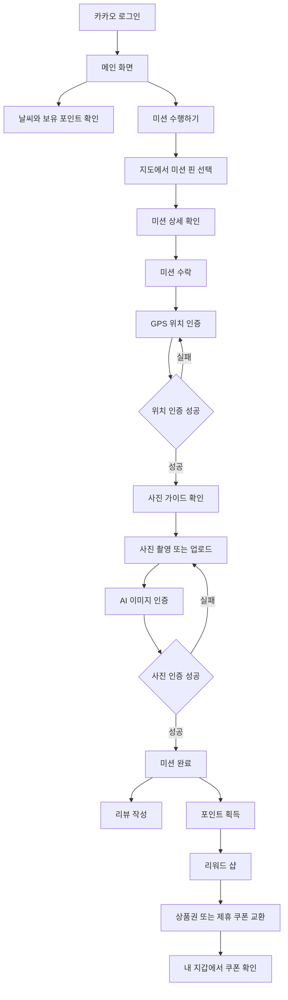

# 레츠꾸
> 구미 지역을 탐방하며 미션을 수행하는 AI 미션형 지역 탐방 서비스

https://github.com/user-attachments/assets/44c1e8a4-e3b3-42ea-8406-28683caf2a4d

 

## 주요 기능
- 카카오 OAuth 기반 로그인 및 JWT access token 인증
- 메인 화면에서 날씨, 보유 포인트, 사용자 프로필 정보 제공
- Google Maps 기반 미션 지도와 카테고리별 커스텀 마커 표시
- 지도에서 미션 선택, 상세 확인, 미션 수락
  - 수락한 미션은 GPS 위치 인증과 AI 기반 사진 인증을 통해 완료
- 브라우저 Geolocation API를 활용한 GPS 위치 인증
- Presigned URL 기반 이미지 업로드 및 AI 사진 인증
- SSE(Server-Sent Events)를 활용한 사진 인증 결과 실시간 수신
- 미션 완료 후 리뷰 작성 및 미션별 리뷰 조회
- 작성 가능한 리뷰와 작성 완료 리뷰를 구분한 활동 내역 관리
- 포인트 기반 리워드 샵 상품 교환

 

## 사용자 흐름

 

## 기술 스택

